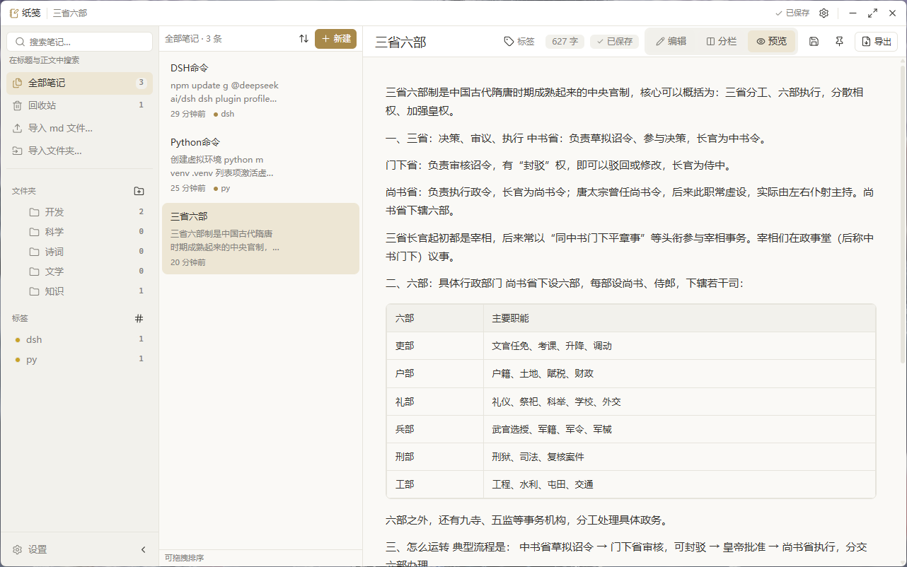
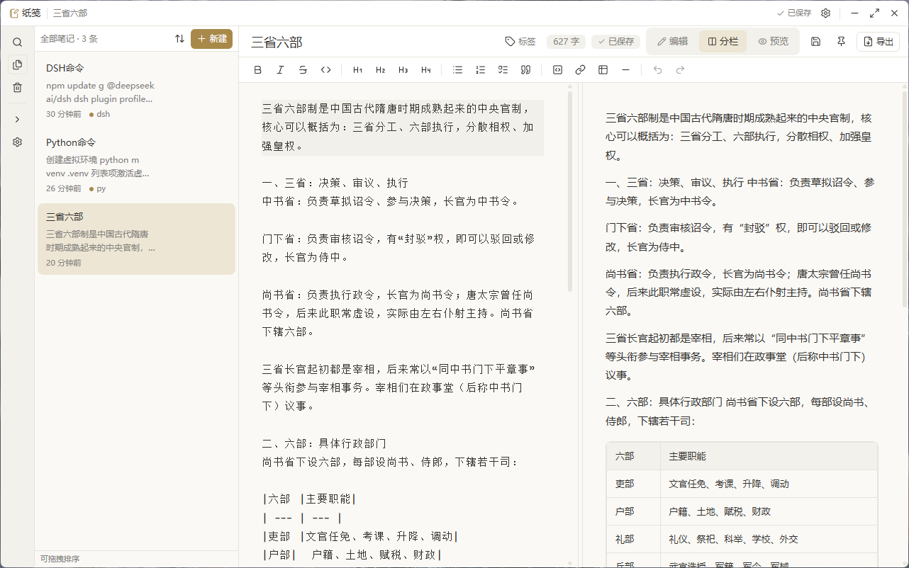
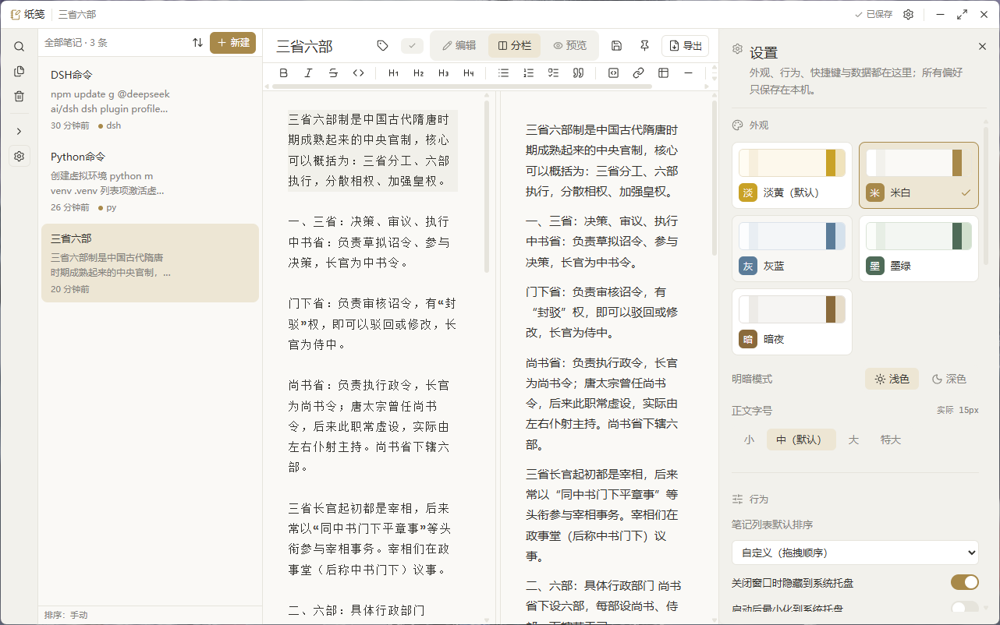
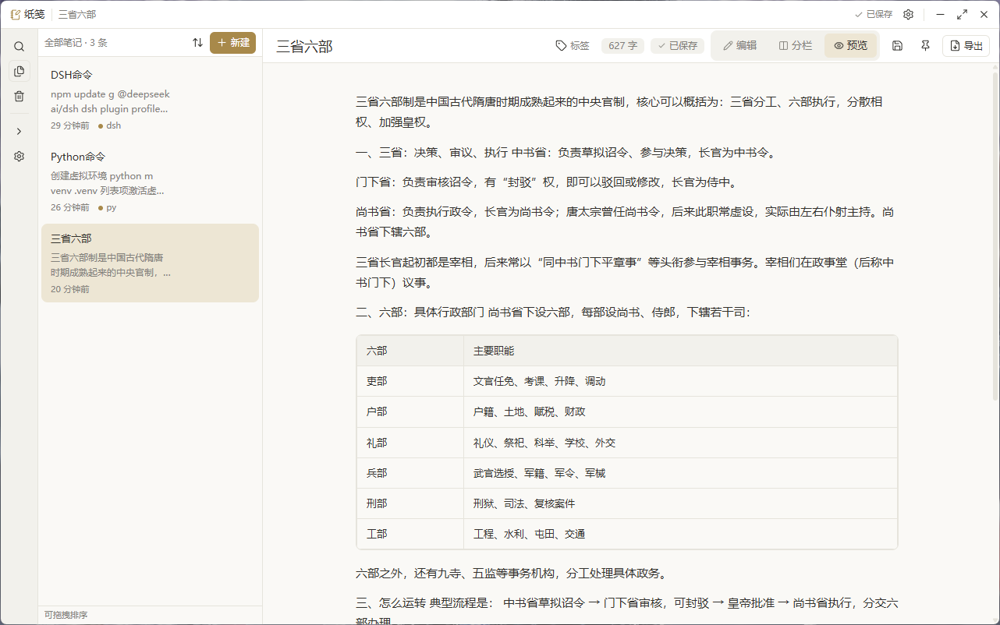
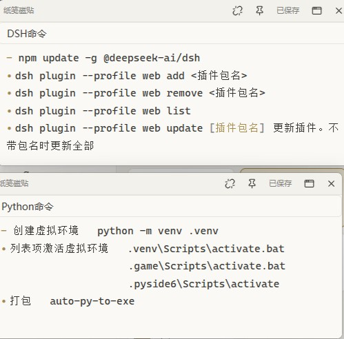

# 纸笺 · zhijian

> 极简淡雅的本地便笺笔记桌面应用 —— Markdown 实时编辑、SQLite 本地存储、全文搜索、系统托盘常驻。

<p>
  
  
  
  
  
</p>

## 界面预览

<p align="center">
  
</p>

<table>
  <tr>
    <td width="50%">
      
      <br><sub><b>分栏</b> —— 左边写 Markdown，右边实时预览</sub>
    </td>
    <td width="50%">
      
      <br><sub><b>设置</b> —— 作为最右侧的一栏，不遮挡列表与正文</sub>
    </td>
  </tr>
  <tr>
    <td width="50%">
      
      <br><sub><b>折叠侧栏</b> —— 只留正文，写作区更宽</sub>
    </td>
    <td width="50%">
      
      <br><sub><b>桌面磁贴</b> —— 可编辑自动保存，可固定，可吸附成组（可在设置里关闭吸附）</sub>
    </td>
  </tr>
</table>

## 特性

| 特性 | 说明 |
| --- | --- |
| 笔记增删改查 | 自动保存，软删除进回收站，可恢复或彻底删除 |
| Markdown 编辑与预览 | CodeMirror 6 编辑器 + Shiki 代码高亮 + GFM 扩展（表格 / 任务列表 / 删除线） |
| 本地存储 | SQLite（`tauri-plugin-sql`），数据完全离线，零云依赖 |
| 全文搜索 | SQLite FTS5 + bm25 排序，命中片段高亮 |
| 文件夹与标签 | 文件夹支持父子层级，标签带自定义颜色 |
| 拖拽排序 | @dnd-kit 实现列表内排序与跨文件夹移动 |
| 导出 | Markdown（含 front-matter）/ 独立 HTML / 纯文本 |
| 无边框窗口 | `decorations: false` + 自定义标题栏，可拖动、可最大化 |
| 全局快捷键 | `Alt+N` 新建笔记、`Alt+Shift+Z` 唤起/隐藏窗口 |
| 系统托盘 | 关闭按钮隐藏到托盘实现后台常驻，托盘菜单可新建 / 设置 / 退出 |
| 桌面便签磁贴 | 把笔记钉成无边框置顶小窗，可编辑自动保存、可固定，可相互吸附成组（吸附可在设置 → 行为里一键关闭） |
| 自定义主题 | 淡黄（默认）/ 米白 / 灰蓝 / 墨绿 / 暗夜，每套含明暗两组 |

## 技术栈

Tauri 2 · React 19 · TypeScript 5.9 · Vite 7 · Tailwind CSS 4 · Zustand 5 ·
CodeMirror 6 · react-markdown 10 + remark-gfm 4 · Shiki 3 · lucide-react ·
@dnd-kit · SQLite (tauri-plugin-sql)

## 快速开始

### 环境要求

- Node.js ≥ 20 与 pnpm ≥ 10（本项目在 pnpm 11.21 上验证）
- Rust 稳定版工具链（≥ 1.77.2）与平台原生编译依赖
- Windows 需安装 [Microsoft C++ 生成工具](https://visualstudio.microsoft.com/visual-cpp-build-tools/) 与 WebView2

### 开发

```bash
pnpm install          # 安装前端依赖（pnpm-workspace.yaml 已放行原生构建脚本）
pnpm tauri:dev        # 启动桌面应用（唯一能跑 SQLite / 托盘 / 全局快捷键的方式）
pnpm dev              # 仅启动浏览器版前端，用于调样式（无数据库、无托盘）
```

### 校验与构建

```bash
pnpm typecheck        # tsc -b，TypeScript 类型检查
pnpm vite:build       # 前端产物构建到 dist/
pnpm check:rust       # cargo check 检查 Rust 后端（首次 5–15 分钟）
pnpm tauri:build      # 生成安装包（Windows: msi / nsis）
```

> 提示：`pnpm build` 只构建前端产物；做真实桌面行为验证（托盘、快捷键、SQLite）请用 `pnpm tauri:dev`。

## 目录结构

```
纸笺/
├─ docs/                  ARCHITECTURE.md（接口契约）· DESIGN.md（设计规范）
├─ public/                静态资源
├─ src/
│  ├─ types/index.ts      ★ 全部领域模型与组件 props 契约（唯一事实来源）
│  ├─ styles/theme.css    ★ 主题 token（--zj-*，5 套主题 × 明暗）
│  ├─ lib/                utils · export · hotkeys · tauri（工具与桥接）
│  ├─ db/                 SQLite 访问层：index · schema · notes · folders · tags · search
│  ├─ store/              Zustand：notes · ui · theme · search
│  ├─ components/ui/      shadcn/ui 风格纯展示组件
│  └─ features/           titlebar · sidebar · notes-list · editor · settings
└─ src-tauri/
   ├─ tauri.conf.json     窗口（decorations:false, 1100×720）与 SQL 预加载
   ├─ capabilities/       插件权限（sql / global-shortcut / dialog / fs / opener）
   ├─ migrations/         版本化 SQL 迁移（1_init.sql …）
   └─ src/                lib · main · events · tray · shortcuts · window
```

## 架构与契约

**写代码前请先读 [`docs/ARCHITECTURE.md`](docs/ARCHITECTURE.md)。** 该文档冻结了：

1. 领域模型（`Note` / `Folder` / `Tag` / `SearchHit`）与 id 生成规则（`crypto.randomUUID()`）
2. Zustand store 接口签字（`notesStore` / `searchStore` / `themeStore` / `uiStore`）
3. db 层导出函数签名（`initDb` / `notesRepo` / `foldersRepo` / `tagsRepo` / `searchRepo`）
4. 组件 props 约定（`TitlebarProps` / `SidebarProps` / `NoteListProps` / `EditorPaneProps` / `SettingsPanelProps`）
5. 主题 token 表与五套主题清单
6. 持久化边界：**UI 状态只在 Zustand 内存，业务数据一律经 `src/db` 落 SQLite**
7. 文件归属表，用于避免并行写冲突

UI 视觉细节（间距 / 圆角 / 字号 / 阴影 / 色值 / 禁止清单）见 [`docs/DESIGN.md`](docs/DESIGN.md)。
**硬性规则：任何颜色、圆角、阴影都只能来自 `--zj-*` token，组件内禁止硬编码色值。**

## 数据位置

数据库文件 `zhijian.db` 由 Tauri 存放在应用数据目录（Windows 为
`%APPDATA%\com.zhijian.app\zhijian.db`）。删除该文件会清空全部本地笔记，请先导出备份。

## 许可证

私有项目，内部使用。
